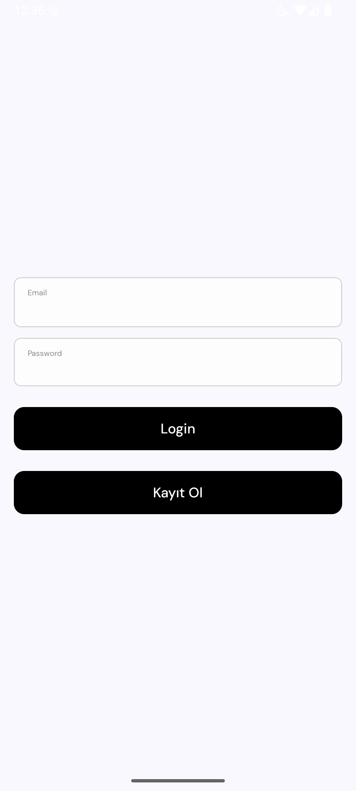
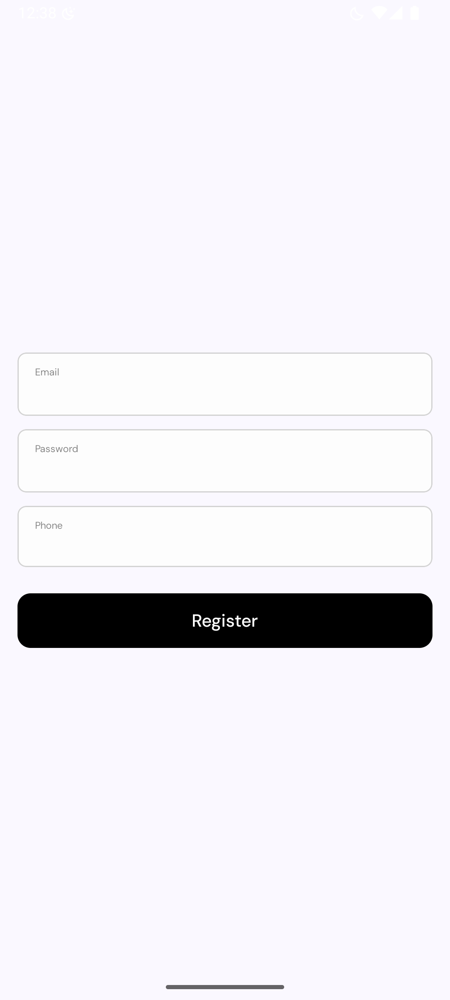

# Loan Management App

Bu proje, kredi yönetimi süreçlerini kolaylaştırmak için geliştirilmiş modern bir Android uygulamasıdır. Kullanıcılar, uygulama üzerinden kredi başvurusu yapabilir, mevcut kredilerini görüntüleyebilir ve kredi detaylarını yönetebilirler.

## Özellikler

- **Kullanıcı Girişi:** E-posta ve şifre ile güvenli giriş.
- **Kayıt Olma:** Yeni kullanıcılar için e-posta, şifre ve telefon numarası ile kayıt olma.

## Ekran Görüntüleri

Aşağıda uygulamanın bazı temel ekran görüntülerini bulabilirsiniz:

| Giriş Ekranı                          | Ana Ekran                              |
| --------------------------------------- | -------------------------------------- |
|  |  |

## Kullanılan Teknolojiler

- **Kotlin**
- **Jetpack Compose**
- **MVVM Mimarisi**
- **Hilt (Dependency Injection)**
- **DataStore**
- **Navigation Component**

## Proje Yapısı (Kısaca)

- `ui/` : Ekranlar ve arayüz bileşenleri
- `data/` : Veri modelleri, repository ve servisler
- `domain/` : Use-case ve domain modelleri
- `core/` : Ortak bileşenler ve yardımcı sınıflar
